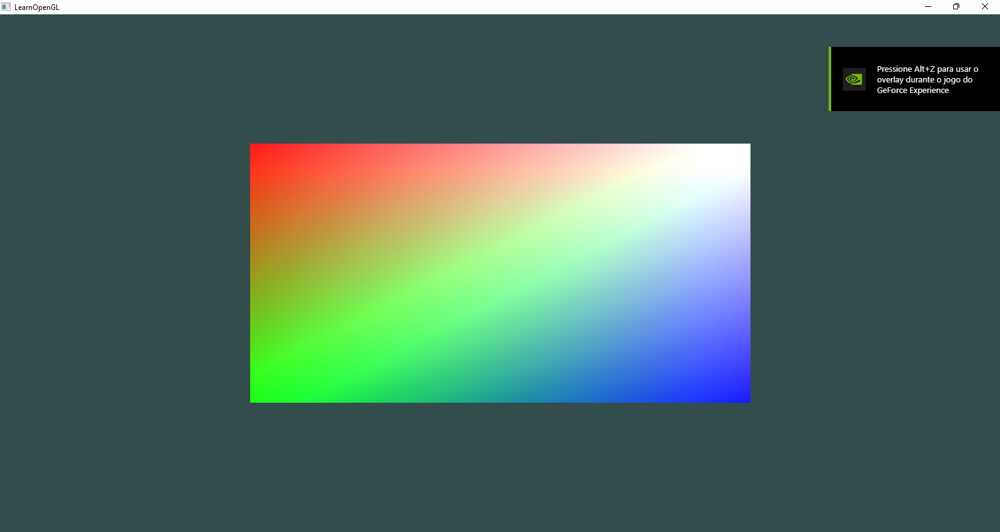

# OpenGLApp



Um projeto de exemplo em C++ utilizando OpenGL 3.3 Core, GLFW, GLAD, GLM e shaders customizados. O objetivo é demonstrar a renderização de um retângulo colorido com interpolação de cores e shaders modernos.

## Funcionalidades
- Janela OpenGL 3.3 Core Profile
- Renderização de um retângulo com cores interpoladas
- Shaders customizados (vertex e fragment)
- Estrutura modular para fácil expansão

## Estrutura do Projeto
```
├── src/main.cpp                # Código principal
├── include/shader_s.h      # Classe utilitária para shaders
├── shaders/                # Shaders GLSL (vertex/fragment)
├── externals/              # Dependências (GLAD, stb, imgui)
├── build/                  # Saída da build (gerada pelo CMake)
├── configure.bat           # Script para configurar e compilar (Windows)
├── CMakeLists.txt          # Configuração do CMake
```

## Dependências
- [GLFW](https://www.glfw.org/) (via MSYS2 ou pkg-config)
- [GLAD](https://glad.dav1d.de/) (já incluso em `externals/`)
- [GLM](https://github.com/g-truc/glm) (via MSYS2 ou pkg-config)
- [stb](https://github.com/nothings/stb) (já incluso)
- [Dear ImGui](https://github.com/ocornut/imgui) (já incluso, mas não utilizado no exemplo principal)
- Compilador C++17 (GCC recomendado)
- [CMake](https://cmake.org/) >= 3.16
- [Ninja](https://ninja-build.org/) (recomendado)

## Como compilar (Windows)
1. Instale as dependências via MSYS2:
   ```sh
   pacman -S mingw-w64-x86_64-toolchain mingw-w64-x86_64-glfw mingw-w64-x86_64-glm mingw-w64-x86_64-cmake mingw-w64-x86_64-ninja
   ```
2. Execute o script de configuração:
   ```sh
   configure.bat
   ```
3. O executável será gerado em `build/opengl_app.exe`.

## Como rodar
1. Certifique-se de que a pasta `shaders/` está ao lado do executável (isso é feito automaticamente pelo CMake).
2. Execute `opengl_app.exe`.

## Créditos
- Baseado em exemplos do [LearnOpenGL](https://learnopengl.com/)
- GLAD, stb, ImGui: [licenças próprias nos respectivos diretórios]

---

Sinta-se à vontade para modificar, estudar e expandir este projeto!
